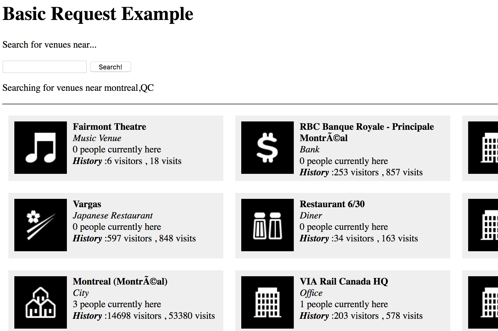

## Using public.php

1. Edit `$client_key` and `$client_secret` in public.php to your app CLIENT_KEY and CLIENT_SECRET (see: https://foursquare.com/developers/apps)
2. From the `examples` directory run `php -S localhost:8888`
3. Navigate your browser to http://localhost:8888/public.php
4. You should see a page like:

